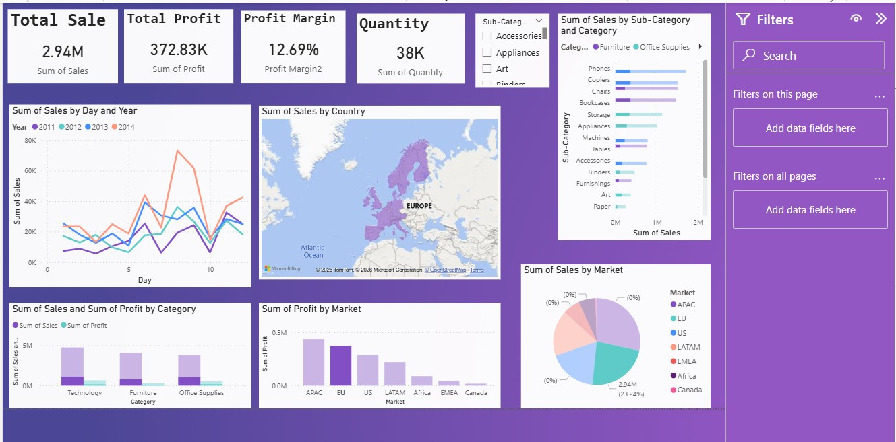

# 📊 Global Superstore Sales Dashboard (Power BI)

## 📌 Overview

This project analyzes the Global Superstore dataset to uncover key business insights and improve decision-making. The goal is to transform raw data into an interactive dashboard that highlights sales performance, customer behavior, and operational efficiency.

## 🎯 Business Problem

The company collects large volumes of data but lacks structured analysis, leading to:

* Poor decision-making
* Missed growth opportunities
* Inefficient resource utilization

## 🎯 Objectives

* Analyze sales, profit, and customer behavior
* Identify top-performing products and regions
* Evaluate shipping performance and operational efficiency
* Build an interactive dashboard for decision-makers

## 🛠️ Tools & Technologies

* Power BI
* Dataset: Global Superstore (CSV)
* Excel (Data Cleaning)

## 📂 Project Structure

global-superstore-dashboard/
│
├── data/              # Dataset
├── pbix/              # Power BI dashboard file
├── screenshots/       # Dashboard images
└── README.md

## 📊 Dashboard Features

### 🔹 Executive Overview

* Total Sales, Profit, Profit Margin
* Sales & Profit trends over time

### 🔹 Customer Insights

* Top customers
* Repeat customer behavior
* Sales by customer segment

### 🔹 Product Insights

* Top-performing products
* Sales by category and sub-category
* Discount impact on profit

### 🔹 Geographic Analysis

* Sales by region, country, and city

### 🔹 Operations

* Shipping performance
* Delivery time analysis
* Order priority insights

## 📸 Dashboard Preview

## 💡 Key Insights

* A small percentage of products generate the majority of sales (Pareto principle)
* High discounts often reduce profitability
* Certain regions outperform others significantly in sales
* Shipping method impacts delivery time and cost

## ▶️ How to Use

1. Clone the repository:

bash
git clone https://github.com/Muradamen/data-science-portfolio.git

2. Open the `.pbix` file in Power BI Desktop

3. Explore the dashboard

## 🚀 Future Improvements

* Add real-time data integration
* Enhance interactivity with drill-through features
* Deploy dashboard to Power BI Service

## 👤 Author

Murad Amin
www.linkedin.com/in/muradamin

#ALXProjectPortfolio
